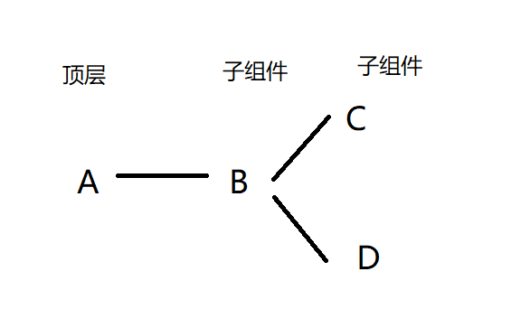
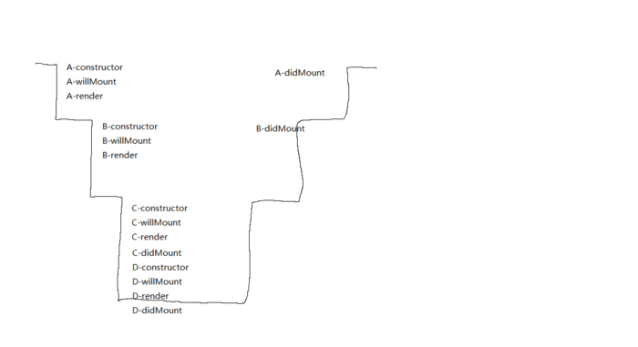
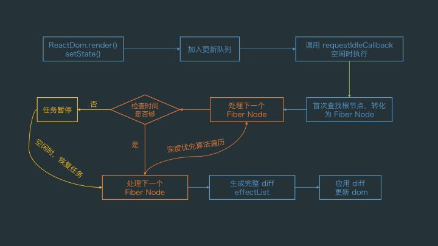

### React Fiber 架构理解

> 引用原文：[React Fiber Architecture](https://github.com/acdlite/react-fiber-architecture)
>
> React Fiber is an ongoing reimplementation of React's core algorithm. It is the culmination of over two years of research by the React team.
>
> The goal of React Fiber is to increase its suitability for areas like animation, layout,and gestures. Its headline feature is incremental rendering: the ability to split rendering work into chunks and spread it out over multiple frames.
>
> Other key features include the ability to pause, abort, or reuse work as new updates come in; the ability to assign priority to different types of updates; and new concurrency primitives.

React Fibre 是 React 核心算法正在进行的重新实现。它是 React 团队两年多的研究成果。

React Fiber 的目标是提高其对动画，布局和手势等领域的适用性。它的主体特征是增量渲染：能够将渲染工作分割成块，并将其分散到多个帧中。

其他主要功能包括在进行更新时暂停，中止或重新使用工作的能力，为不同类型的更新分配优先权的能力和新的并发原语。

### React16之前组件的渲染逻辑

**先来看一下react组件渲染时经历的生命周期：**

挂载阶段：
- `constructor()`
- `componentWillMount()`
- `render()`
- `componentDidMount()`

更新阶段：
- `componentWillReceiveProps()`
- `shouldComponentUpdate()`
- `componentWillUpdate()`
- `render()`
- `componentDidUpdate`

卸载阶段：
- `componentWillUnmount()`

**在之前的版本中，如果你实现一个很复杂的深度嵌套的复合组件，会出现下面的情况：**

现有层级关系如下的四个组件：



组件渲染时调用的生命周期顺序：
  
  

  上图展示的是A,B,C,D的挂载阶段调用的生命周期渲染顺序，可以看到从顶层组件开始调用各生命周期，一直向下，直至调用完最底层子组件的生命周期。然后再向上调用。
  组件更新阶段同理。
  
组件挂载之后，假如修改最上层组件的数据（state），组件更新时的调用栈：

  

  如果这是一个很大，层级很深的组件，可以想像到，组件在渲染时，调用栈过长，再加上如果在期间进行了各种复杂的操作，就可能导致长时间阻塞主线程，react渲染它需要几十甚至几百毫秒，这样的话react就会一直占用浏览器主线程，任何其他的操作（包括用户的点击，鼠标移动等操作）都无法执行，带来非常不好的用户体验。


### React Fiber的出现
React Fiber 就是为了解决上面的问题而生。
> 好似一个潜水员，当它一头扎进水里，就要往最底层一直游，直到找到最底层的组件，然后他再上岸。**在这期间，岸上发生的任何事，都不能对他进行干扰，如果有更重要的事情需要他去做（如用户操作），也必须得等他上岸。**
>
> Fiber 本质上是一个虚拟的堆栈帧，新的调度器会按照优先级自由调度这些帧，从而将之前的同步渲染改成了异步渲染，在不影响体验的情况下去分段计算更新。**它让潜水员会每隔一段时间就上岸，看是否有更重要的事情要做。**


对于如何区别优先级，React 有自己的一套逻辑。对于动画这种实时性很高的东西，也就是 16 ms 必须渲染一次保证不卡顿的情况下，React 会每 16 ms（以内） 暂停一下更新，返回来继续渲染动画。

### React Fiber 架构
#### 调度拆分为小任务
浏览器本身也不断进化中，随着页面由简单的展示转向WebAPP，它需要一些新能力来承载更多节点的展示与更新。
下面是一些自救措施：
* requestAnimationFrame
* requestIdleCallback
* web worker
* IntersectionObserver

react官方采用的是 [requestIdleCallback](https://developer.mozilla.org/zh-CN/docs/Web/API/Window/requestIdleCallback)，为了兼容所有平台，facebook 单独实现了其功能，作为一个独立的 npm 包使用 react-schedule

> 其作用是会在浏览器空闲时期依次调用函数， 这就可以在主事件循环中执行后台或低优先级的任务，而且不会对像动画和用户交互这样延迟触发而且关键的事件产生影响。函数一般会按先进先调用的顺序执行，除非函数在浏览器调用它之前就到了它的超时时间。

**简化后的大致流程图如下：**


  

#### Fiber Node 及 Fiber Tree

* 从流程图上看到会有 Fiber Node 节点，这个是在 react 生成的 Virtual Dom 基础上增加的一层数据结构，主要是为了将递归遍历转变成循环遍历，配合 requestIdleCallback API, 实现任务拆分、中断与恢复。为了实现循环遍历，Fiber Node 上携带了更多的信息。
* 每一个 Fiber Node 节点与 Virtual Dom 一一对应，所有 Fiber Node 连接起来形成 Fiber tree, 是个单链表树结构

#### 两个阶段：`reconciliation` 和 `commit`
对于异步渲染，现在渲染有两个阶段：`reconciliation` 和 `commit` 。前者过程是可以打断的，后者不能暂停，会一直更新界面直到完成。

**reconciliation 处理过程**
* 当执行 setState() 或首次 render() 时，进入工作循环，循环体中处理的单元为 Fiber Node, 即是拆分任务的最小单位，从根节点开始，自顶向下逐节点构造 workInProgress tree（构建中的新 Fiber Tree）。
>
* 每个工作处理单元做的事情，由 beginWork(), completeUnitOfWork() 两部分构成。
>
* beginWork()主要做的事情是从顶向下生成所有的 Fiber Node，并标记 Diff, 不包括兄弟节点，每个 Fiber Node 的处理过程根据组件类型略有差异，以 ClassComponent 为例：
1 如果当前节点不需要更新，直接把子节点clone过来，要更新的话标记更新类型
2 更新当前节点状态（props, state, context等）
3 调用shouldComponentUpdate()
4 调用组件实例方法 render() 获得新的子节点，并为子节点创建 Fiber Node（创建过程会尽量复用现有 Fiber Node，子节点增删也发生在这里）
5 如果没有产生 child fiber，进入下一阶段 completeUnitOfWork
>
* completeUnitOfWork() 当没有子节点，开始遍历兄弟节点作为下一个处理单元，处理完兄弟节点开始向上回溯，直到再次回去根节点为止，将收集向上回溯过程中的所有 diff，拿到 diff 后开始进入 commit 阶段。
>
* 构建 workInProgress tree 的过程就是 diff 的过程，通过 requestIdleCallback 来调度执行一组任务，每完成一个任务后回来看看有没有插队的（更紧急的），把时间控制权交还给主线程，直到下一次 requestIdleCallback 回调再继续构建workInProgress tree。
#### 两个阶段涉及到的生命周期：

**Reconciliation** 阶段 （*React算法，用来比较2颗树，以确定哪些部分需要重新渲染*）

- `componentWillMount`
- `componentWillReceiveProps`
- `shouldComponentUpdate`
- `componentWillUpdate`

**Commit** 阶段 （*用于呈现React应用的数据更改。通常是`setState`的结果。最终导致重新渲染。*）

- `componentDidMount`
- `componentDidUpdate`
- `componentWillUnmount`

因为 `reconciliation` 阶段是可以被打断的，所以 `reconciliation` 阶段会执行的生命周期函数就可能会出现调用多次的情况，从而引起 Bug。所以对于 `reconciliation` 阶段调用的几个函数，除了 `shouldComponentUpdate` 以外，其他都应该避免去使用，并且 React16 中也引入了新的 API 来解决这个问题。

于是官方推出了`getDerivedStateFromProps`，让你在render设置新state，你主要返回一个新对象，它就主动帮你setState。由于这是一个静态方法，你不能取到 `this`，当然你也不能操作`instance`，这就阻止了你多次操作setState。这样一来，`getDerivedStateFromProps`的逻辑应该会很简单，这样就不会出错，不会出错，就不会打断DFS过程。

`getDerivedStateFromProps`取代了原来的`componentWillMount`与`componentWillReceiveProps`方法，该函数会在组件 初始化 和 更新 时被调用

```js
class ExampleComponent extends React.Component {
  // Initialize state in constructor,
  // Or with a property initializer.
  state = {};

  static getDerivedStateFromProps(nextProps, prevState) {
    if (prevState.someMirroredValue !== nextProps.someValue) {
      return {
        derivedData: computeDerivedState(nextProps),
        someMirroredValue: nextProps.someValue
      };
    }

    // Return null to indicate no change to state.
    return null;
  }
}
```
在进入commi阶段时，组件多了一个新钩子叫`getSnapshotBeforeUpdate`，它与commit阶段的钩子一样只执行一次。
`getSnapshotBeforeUpdate` 用于替换 `componentWillUpdate` ，该函数会在 `update` 后 DOM 更新前被调用，用于读取最新的 DOM 数据。

于是整个流程变成这样：（引用大神@司徒正美的图）


### React16 生命周期函数用法建议
结合 React Fiber 架构 建议如下使用react生命周期
```javascript
class ExampleComponent extends React.Component {
  // 用于初始化 state
  constructor() {}
  // 用于替换 `componentWillReceiveProps` ，该函数会在初始化和 `update` 时被调用
  // 因为该函数是静态函数，所以取不到 `this`
  // 如果需要对比 `prevProps` 需要单独在 `state` 中维护
  static getDerivedStateFromProps(nextProps, prevState) {}
  // 判断是否需要更新组件，多用于组件性能优化
  shouldComponentUpdate(nextProps, nextState) {}
  // 组件挂载后调用
  // 可以在该函数中进行请求或者订阅
  componentDidMount() {}
  // 用于获得最新的 DOM 数据
  getSnapshotBeforeUpdate() {}
  // 组件即将销毁
  // 可以在此处移除订阅，定时器等等
  componentWillUnmount() {}
  // 组件销毁后调用
  componentDidUnMount() {}
  // 组件更新后调用
  componentDidUpdate() {}
  // 渲染组件函数
  render() {}
  // 以下函数不建议使用
  UNSAFE_componentWillMount() {}
  UNSAFE_componentWillUpdate(nextProps, nextState) {}
  UNSAFE_componentWillReceiveProps(nextProps) {}
}
```

### 16 大版本主要更新还解决以下痛点：

* 组件不能返回数组，最见的场合是UL元素下只能使用LI，TR元素下只能使用TD或TH，这时这里有一个组件循环生成LI或TD列表时，我们并不想再放一个DIV，这会破坏HTML的语义。
* 弹窗问题，之前一直使用不稳定的unstable_renderSubtreeIntoContainer。弹窗是依赖原来DOM树的上下文，因此这个API第一个参数是组件实例，通过它得到对应虚拟DOM，然后一级级往上找，得到上下文。它的其他参数也很好用，但这个方法一直没有转正。。。
* 异常处理，我们想知道哪个组件出错，虽然有了React DevTool，但是太深的组件树查找起来还是很吃力。希望有个方法告诉我出错位置，并且出错时能让我有机会进行一些修复工作
* HOC的流行带来两个问题，毕竟是社区兴起的方案，没有考虑到ref与context的向下传递。
* 组件的性能优化全凭人肉，并且主要集中在SCU，希望框架能干些事情，即使不用SCU，性能也能上去。

####新特性：
* render / 纯组件能够 return 任何数据结构
* CreatePortal API，更好的处理 Dialog 这种场景组件
* 新的 context api，尝试代替一部分 redux 的职责
* 异步渲染/时间切片(time slicing)，成倍提高性能
* componentDidCatch，错误边界，框架层面上提高用户 debug 的能力
* 网络请求 IO(Suspense)，更好的处理异步网络 IO

___


#### 参考资料：
 - [React Fiber架构](https://zhuanlan.zhihu.com/p/37095662)
 - [React Fiber Architecture](https://github.com/acdlite/react-fiber-architecture)
 - [React系列——React Fiber 架构介绍资料汇总（翻译+中文资料）](https://segmentfault.com/a/1190000012834204)
 - [InterviewMap——React周期分析](https://yuchengkai.cn/docs/zh/frontend/react.html)